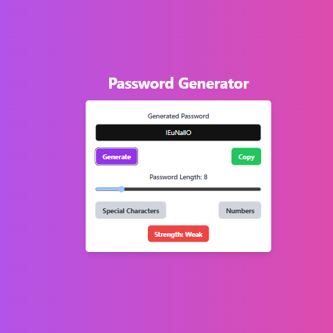
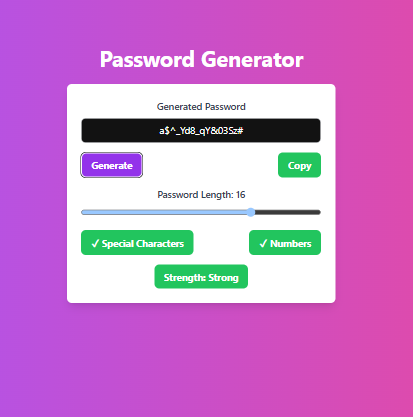
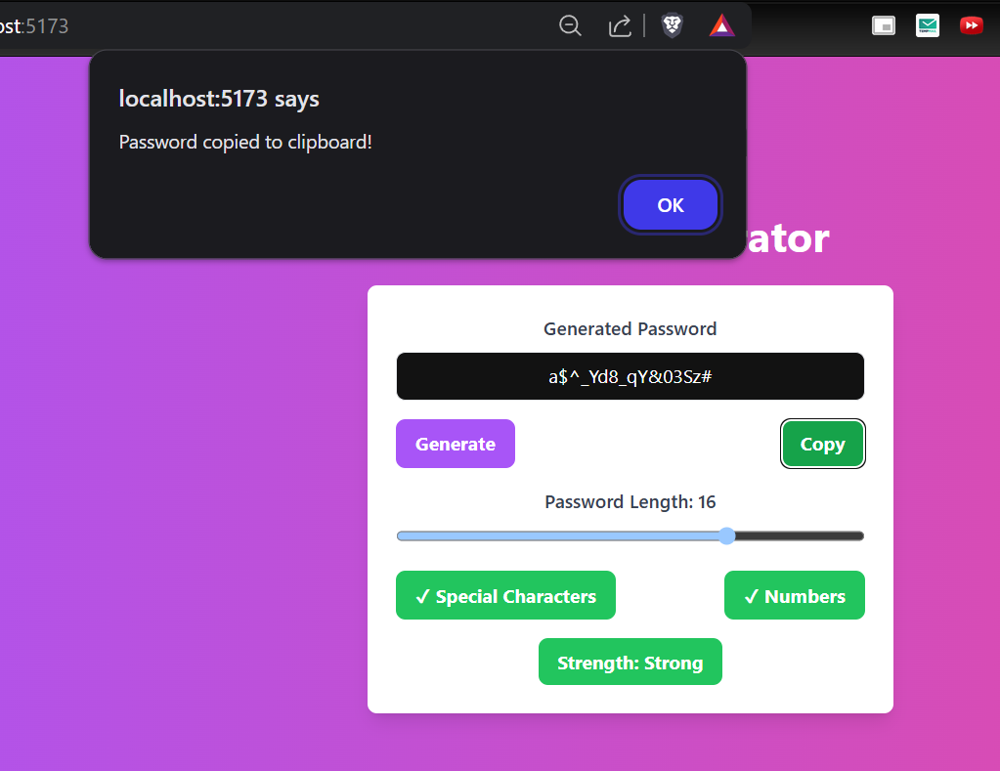

# 📝 Todo App

A clean and intuitive Todo App built with React and Tailwind CSS. Easily manage your daily tasks with features like adding, editing, deleting, and marking todos as complete. Enjoy a responsive and visually appealing interface for productivity on any device.

---

## 🚀 Features

- Add new todos quickly
- Edit existing todos
- Delete todos
- Mark tasks as completed or active
- Filter todos by status (All, Active, Completed)
- Responsive and modern UI with Tailwind CSS
- Persistent state with local storage (optional)

---

## 📸 Preview

| Description           | Screenshot                 |
|----------------------|----------------------------|
| Todo List            |   |
| Adding a Todo        |    |
| Editing a Todo       |   |
| Completed Todos      |   |

---

## 🛠 Tech Stack

- **React** (Functional Components, Hooks)
- **Tailwind CSS**
- **JavaScript (ES6+)**

---

## 📦 Installation

```bash
# Clone the repository
git clone https://github.com/yourusername/todo-app.git
cd todo-list

# Install dependencies
npm install

# Start the development server
npm start
```

---

## 📁 Project Structure

```plaintext
todo-app/
├── public/
├── src/
│   ├── App.jsx
│   ├── index.css
│   ├── main.jsx
│   ├── TodoInput.jsx
│   ├── TodoItem.jsx
│   ├── TodoList.jsx
├── package.json
├── tailwind.config.js
├── vite.config.js
└── README.md
```

---

## 📝 License

This project is licensed under the MIT License.
